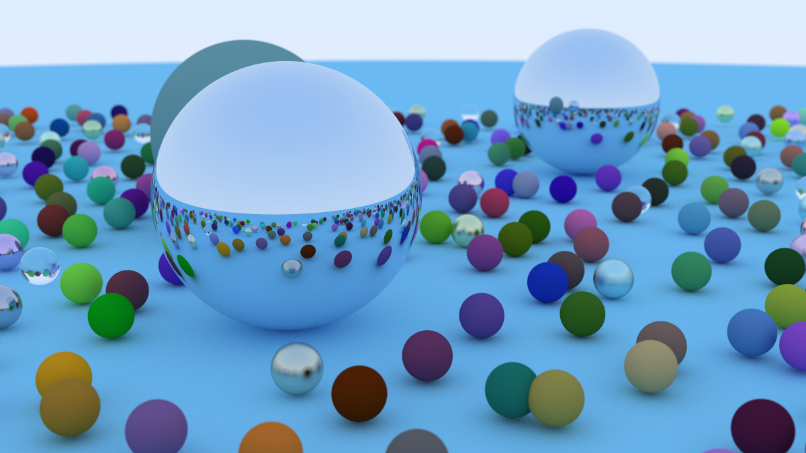

<div align="center">
  
</div>

# raytracing.zig

Zig implementation of a ray tracer by following along with the Ray Tracing in One Weekend book.
Link below:

[_Ray Tracing in One Weekend_](https://raytracing.github.io/books/RayTracingInOneWeekend.html)

## Usage
```bash
# for now, make changes to rendered scene in src/main.zig
# <make changes>
zig build -Doptimize=ReleaseFast
zig-out/bin/rtow > image.ppm
```

## TODO
- [ ] Unit tests

- [ ] Configurable renders

- [ ] Optimizations (e.g. SIMD)